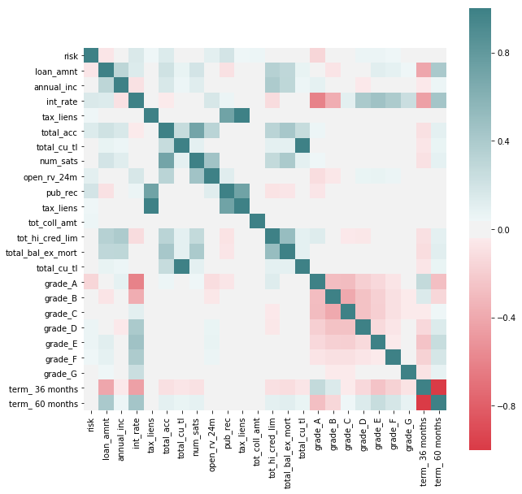

```
loan_df.groupby(['loan_status']).agg({'loan_status': np.size})
```


We see that there are categories of the loan_status have very few observations. Since we are really interested in the loan getting to good term, instead of trying to predict the status, we turn it in a binary category, indicating if it is current (non risky) or falls into any of the other categories, which we'll call risky.

```
loan_df['risk'] = int(0)
badLoan = ['Charged Off','Late (31-120 days)', 'Late (16-30 days)', 'In Grace Period']

loan_df.loc[(loan_df['delinq_amnt'] > 0) | (loan_df['pct_tl_nvr_dlq'] != 100) | 
            (loan_df['total_rec_late_fee'] > 1) | (loan_df['delinq_2yrs'] > 0) | 
            (loan_df['pub_rec_bankruptcies'] > 0) | (loan_df['debt_settlement_flag'] != 'N') |
             loan_df['loan_status'].isin(badLoan),'risk'] = 1

predDefault = loan_df[['risk','grade','loan_amnt','annual_inc','term','int_rate','emp_length','tax_liens','total_acc',
                       'total_cu_tl','hardship_loan_status','num_sats','open_rv_24m','pub_rec','tax_liens',
                       'tot_coll_amt','tot_hi_cred_lim','total_bal_ex_mort','total_cu_tl']]

predDefault = pd.get_dummies(predDefault, columns=['grade', 'term'], drop_first = False)

f, ax = plt.subplots(figsize=(10, 10))

corr = predDefault.corr()
sns.heatmap(corr, mask=np.zeros_like(corr, dtype=np.bool), cmap=sns.diverging_palette(10, 200, as_cmap=True, center ='light'), square=True, ax=ax)
```


We see some correlations that may be interesting to explore further between features that indicate potential risk (as by the new feature added to the dataset) and others. We see that the variables by which Lending Club seems to grade loans do indeed have a potential effect on risk (such as term of loan or loan ammount) but we also see others that they don't seem to take in so much consideration as having tax lien or derogatory public records.

It's interesting to point out that better grades, as assigned by Lending Club, don't necessarily correspond with less risk of default, as seen by "charged off" having a negative correlation with Grade G and positive with better levels.

In favor of Lending Club's grading system we see that there seems to be an intrinsic higher risk on higher interest paying loans, at least through this rough preliminary analysis.

```
loans_df = loan_df.copy()

# Drop columns that have been included in imputing the value of the 'risk' new feature
loans_df = loans_df.drop(['delinq_amnt','pct_tl_nvr_dlq','total_rec_late_fee','delinq_2yrs','pub_rec_bankruptcies','loan_status'], axis=1)

#Include all continuous features and outcome 'risk' class
loans_df = loans_df.select_dtypes(include=['float64']).join(loans_df['risk'])

# Include discrete variables that have shown a potential relation with the outcome.
loans_df = loans_df.join(loan_df[['term','grade','emp_length','home_ownership']])
```

```
def get_columns_to_drop(df):
    """Returns a list of columns from df that is all NaN"""
    columns_to_drop = []
    for col in loans_df.columns:
        unique_rows = loans_df[col].unique()
        if (unique_rows.size == 1 and not isinstance(unique_rows[0], str) and np.isnan(unique_rows[0])):
            columns_to_drop.append(col)
    return columns_to_drop
```

```
# drop columns that contains all NaN values
loans_df_columns_to_drop = get_columns_to_drop(loans_df)
loans_df = loans_df.drop(loans_df_columns_to_drop, axis=1)
```

We now process NaN on a column by column basis to impute the appropriate value in each case

```
# After studying each column, we see that the best way to remove nan for these cases is to impute 0
for col in loans_df.columns:
    loans_df[col].fillna(0, inplace=True)
```

After cleaning the dataset of `loans_df`, we were able to reduce from 145 categories to 55 categories.

### Dimensionality Reduction

```
# In order to be able to apply PCA we need to hot-one-code all the categorical variables in the dataset
loans_df = pd.get_dummies(loans_df, columns=['term','grade','emp_length','home_ownership'], drop_first=True, prefix=['term_','grade_','emp_','home_'])
```
```
# Split dataset between train and test. We stratify on 'risk' to make sure that we have representation of both categories in the datasets.
loans_train, loans_test = train_test_split(loans_df, test_size=0.2, random_state=8, stratify=loans_df['risk'])

x_train = loans_train.drop(['risk'], axis=1)
y_train = loans_train['risk']

x_test = loans_test.drop(['risk'], axis=1)
y_test = loans_test['risk']

# We scale continuous variables before applying PCA
scale_transformer = StandardScaler(copy=True).fit(x_train)
x_train_scaled = scale_transformer.transform(x_train)
x_test_scaled = scale_transformer.transform(x_test)


# Generate 10 PCA to study the amount of variance that each of them is able to explain
pca_transformer = PCA(10).fit(x_train_scaled)
x_train_10 = pca_transformer.transform(x_train_scaled)
x_test_10 =  pca_transformer.transform(x_test_scaled)
```
```
# Plot first two components to explore if they are able to discriminate among classes.
colors = ['g','r']
label_text = ["NonRisk", "Risk"]
markers = ["o","x"]

for risk in [0,1]:
    cur_df = x_train_10[y_train==risk]
    plt.scatter(cur_df[:,0], cur_df[:,1], c = colors[risk], label=label_text[risk], alpha = .7, marker=markers[risk])
    
plt.xlabel("PCA Dimension 1")
plt.ylabel("PCA Dimention 2")
plt.title("PCA")
plt.legend();
```

